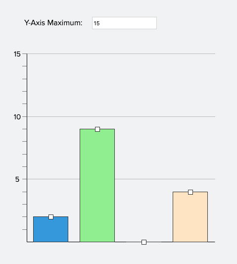
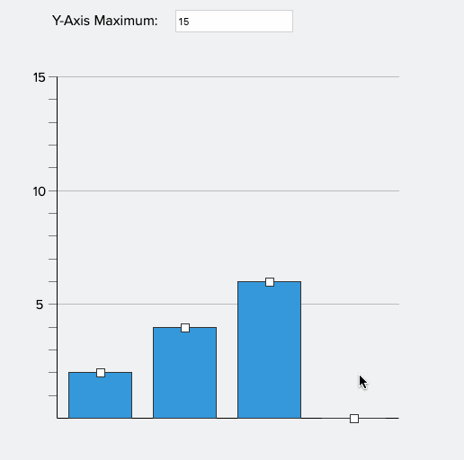

# Frontend Test Task

- X offers interactive content which allows students to demonstrate their understanding of mathematical concepts. For this task, we want you to create an interactive histogram component in React

- 
 
- We wish to give you every opportunity to demonstrate how you code and what you value in developing a maintainable codebase; you can over-engineer parts of this.

- Please include: a readme explaining design choices and assumptions. 

## Requirements

- **No 3rd party charting or drag-and-drop libraries** - we are testing your ability to create complex UIs and interactions

- As we use React.js for our application development, please only use `react` and `react-dom` as the view library.

- You are allowed to use js utilities libraries: `lodash`, `ramda`, `jquery`, etc

- Please limit your use of 3rd party libraries - exercise your judgement but we want to see how you approach creating this component 

- Please add to your README, why you choose to use a particular library/utility

- Feel free to use TypeScript/Flow if that's what you prefer; untyped JavaScript is perfectly fine too.

## Specification 

- 1-4 bars can be configured

- Initial starting values can be set for each bar

- The user should be able to drag the columns to a particular whole-number value

- 

- A read-only mode should be able to be set

- The Y-axis maximum can be set on initialisation and can be dynamically changed after rendering. Changing the Y-axis maximum should **not** change the dimensions of the graph itself (eg. if the graph is 300px   × 300px, this should not change).

- The Y-axis should not be able to be set lower than the histogram columns

- The page should be able to have multiple components at a time  
  
### Instructions

- Try not to spend more that 4 hours maximum (We don't want you to lose a weekend over this)

- Use this bootstrapped [Create React App](https://github.com/facebookincubator/create-react-app)

- Strict pixel perfection is not necessary.

- Adhering to the design isn't necessary but it should match functionally

- Aim for compatibility with *one* browser of your choice.

- You may have questions as you interpret and implement the component, use your best judgment – we're interested in understanding your decisions.

## Design choices

The main component is called AdjustableBarChart. It is a controlled component that is demonstrated in custom showcase/storybook - views/AdjustableChartView. It supports mouse, keyboard and touch events. It implements basica accessibility standards for screen readers and for keyboard only users. The chart is implemented with a bunch of HTMLDivElements that are styled to resembled bar chart. The same could be achieved with SVG however due to simplicity of the chart which is consisted of rectangles only, divs were sufficient.

### Third party libraries
- lodash.throttle - optimising performance by reducing callback execution
- react-app-rewired and customize-cra - extending create-react-app without ejecting
- @emotion - CSS in JS, styled components, scoped selectors
- typescript - static types for better DX, maintainability and enforcing proper use of components and functions
- @testing-library/react - library for simpler unit tests enforcing best practices out of the box

### Nice to have
- Better test coverage
- End-to-end tests using Cypress
- Pre-commit hooks for formatting
- CI for linting, type checking, unit testing
- Proper storybook showcase and documentation